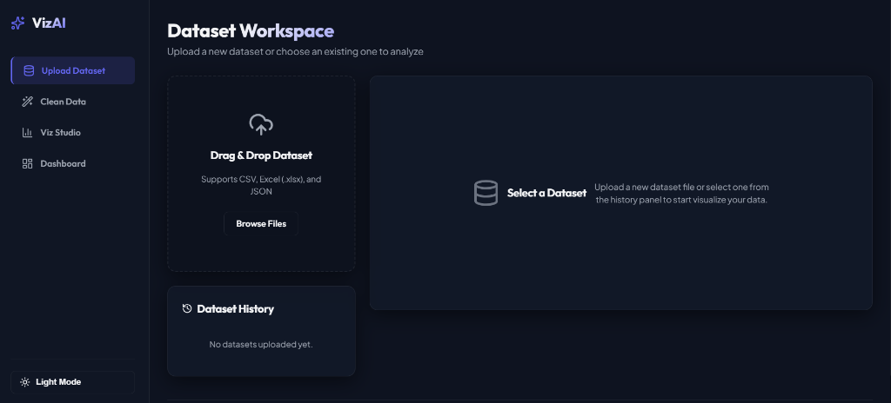
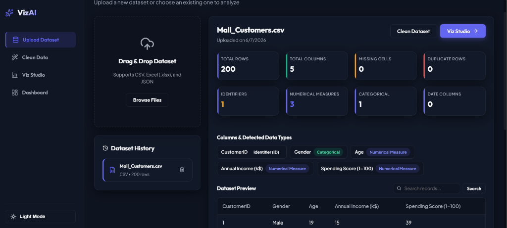
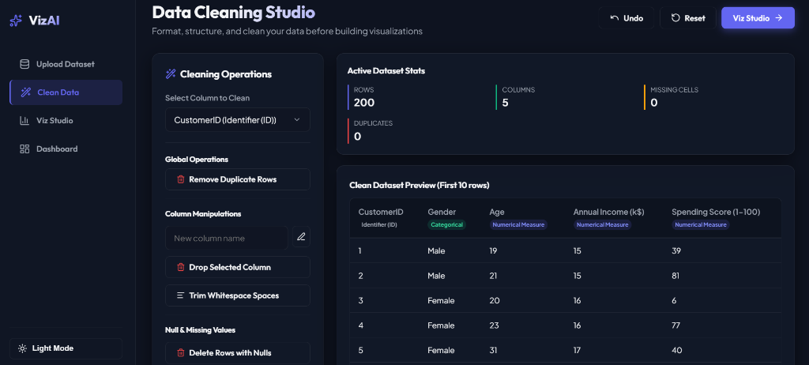
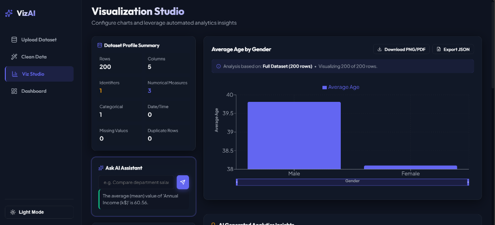

# VizAI - Intelligent Data Visualization and Analytics Platform

VizAI is a full-stack web application designed for students, researchers, analysts, and business owners. It simplifies data analysis by allowing users to upload datasets, clean anomalies, receive automated statistical recommendations, build customizable dashboards, and query their data using natural English.

---

## Application Screenshots

### 1. Dataset Workspace (Empty State)


### 2. Dataset Profile & Preview


### 3. Data Cleaning Studio


### 4. Visualization Studio & AI Assistant


---

## Technical Architecture

- **Backend**: Python FastAPI with Pandas & NumPy. Operates on a SQLite database wrapper (designed with SQLAlchemy for easy transition to PostgreSQL or MongoDB).
- **Frontend**: Vite + React, stylized with a custom Vanilla CSS design system (supporting dark/light theme triggers, glassmorphism, responsive grids, and subtle micro-animations) and using Recharts for visual graphs.
- **Analytics Engine**: Runs 100% offline using SciPy and Pearson correlation matrices for outliers, skewness, and trend slopes.
- **NLQ Engine**: Integrates a lightweight English stemmer to fuzzy-match statements (like "Compare salaries") to table columns.

---

## Directory Layout

```
VIZAI/
├── backend/                  # Python FastAPI Backend
│   ├── app/
│   │   ├── database/         # SQLAlchemy DB session
│   │   ├── models/           # SQLAlchemy schemas (User, Dataset, Dashboard)
│   │   ├── routes/           # FastAPI routers (auth, datasets, dashboards)
│   │   ├── services/         # Core logic (cleaner, insights, detector, NLQ)
│   │   ├── utils/            # Auth and hashing helpers
│   │   └── tests/            # Unit tests
│   ├── requirements.txt      # Backend Python dependencies
│   └── .env                  # Port, DB, and key configurations
├── frontend/                 # Vite + React Frontend
│   ├── src/
│   │   ├── assets/           # Global visual CSS stylesheets
│   │   ├── components/       # Shared elements (Sidebar)
│   │   ├── context/          # Global Auth and Theme controllers
│   │   ├── pages/            # Core views (Auth, Upload, Cleaning, Studio, Dashboard)
│   │   ├── services/         # API fetch calls wrapper
│   │   └── App.jsx           # Routes and Shell manager
│   └── package.json          # Frontend packages list
└── README.md                 # Project guide
```

---

## Getting Started

### 1. Backend Server Setup

Navigate into the `backend/` directory, set up your configuration, and start the FastAPI web server:

```bash
cd backend

# The virtual environment is already created under .venv/
# Activate virtual environment (Windows Powershell):
.venv\Scripts\Activate.ps1

# Run the database migrations & start Uvicorn server:
.venv\Scripts\python.exe -m uvicorn app.main:app --reload --port 8000
```

The API documentation will be available at `http://127.0.0.1:8000/docs`.

### 2. Frontend Development Server

Navigate into the `frontend/` directory, install packages, and start the Vite server:

```bash
cd frontend

# Install Node modules (already cached on local development environment):
npm install

# Start the dev server:
npm run dev
```

Open your browser and navigate to `http://localhost:5173`.

### 3. Run Analytical Tests

Run the test suite to verify analytical services (type detection, cleaning replay, NLQ parsing):

```bash
cd backend
.venv\Scripts\python.exe -m unittest discover -s app/tests
```

---

## Visual & Cleaning Features

1. **Tab-isolated Workspaces**: Free open mode without login screens. Workspaces are isolated per browser tab using auto-generated `sessionStorage` tokens, so opening a new tab or device displays a fresh workspace while preserving data on tab refreshes.
2. **Metadata Stats**: Displays total rows, column types, duplicate rows, missing cell counts, and memory usage.
3. **Data Cleaning**: One-click actions to drop columns, rename columns, fill null cells (with average, median, mode, or constants), convert type classifications, and trim whitespaces. Includes complete Undo / Reset capabilities.
4. **Viz Studio**: Custom plotting for Bar, Line, Pie, Donut, Area, Scatter, Histogram, and Radar charts. Includes axis validation and suggestions (e.g., checks Y-axis is numerical for Bar charts).
5. **AI Analytics Insights**: Detailed outlier counts, skewness distributions, dominant categories, and correlation pairs.
6. **Dashboard Builder**: Customizable canvas layout with a footer showing `Designed & Developed by Abhishek`. Users can add widgets, resize, save dashboards, and view computed summaries (Median, Average, Standard Deviation, and Variance).
7. **Advanced NLQ Assistant**:
   - **Strict Parser separation**: Separates grouping (`by`, `grouped by`) from filtering (`where`, `for`, `in`) keywords to ensure filters are never mistaken for grouping actions.
   - **Strict Match Priority**: Matches columns strictly based on Priority Tree (Exact match -> Longest match -> Case-insensitive -> Fuzzy fallback).
   - **Direct Counts Formatting**: If asking "How many..." or "Count...", displays formatted numeric counts and percentages directly first (e.g., `Present students: 8,508\nPercentage: 98.8%`) before showing supporting charts.
   - **Relationship Priority**: Prioritizes Scatter Plots and correlation statistics for queries containing relationship/correlation intent, completely bypassing Histograms.

---

## Deployment

Refer to the step-by-step [deployment_guide.md](./deployment_guide.md) for production hosting options:
- Option 1: Hosting on Render (Cloud Platform) using a Persistent Disk for SQLite database & uploads.
- Option 2: Hosting on a VPS (DigitalOcean / AWS / Hostinger) using Nginx, Systemd, and Uvicorn.

